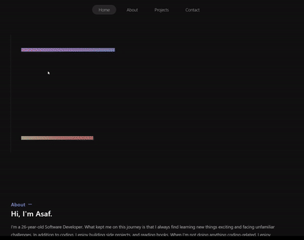

# 🎨 Creative Portfolio



This portfolio is a showcase of a frontend developer's work, featuring various sections.

## 📦 Technologies

Built with:

- `CSS:` For styling.
- `React:` A JavaScript library for building user interfaces.
- `TypeScript:` Adds static types to JavaScript for safer and more predictable code.
- `React Icons:` Utilized for scalable vector icons.
- `Framer Motion:` For animation effects.

## ⚙️ Getting Started

To view the portfolio:

1. Ensure you have installed all necessary dependencies with `npm install`.
2. Start the development server by running `npm run dev`.
3. Open your web browser and go to [http://localhost:5173](http://localhost:5173) to start exploring.

## 🖱️ Navigating Through the Sections

The portfolio is divided into several key sections, each designed to offer a unique perspective on the developer's skills and projects. Here's how to navigate through these sections:

### 🏠 Home

- **Access**: Click on the 'Home' link in the navigation bar.
- **Content**: Displays an introductory animation and the developer's main slogan. Scroll down to start exploring other sections automatically or use the navigation bar for quicker access.

### 👤 About

- **Access**: Click on 'About' in the navigation bar or scroll down from 'Home'.
- **Content**: Offers a detailed biography and background of the developer. This section aims to give you a personal look at the developer's journey and interests.

### 💼 Projects

- **Access**: Select 'Projects' from the navigation bar.
- **Features**:
  - **Project Cards**: Each card represents a project with a brief overview. Click on the GitHub or live site links within the cards to explore more about each project.
  - **Technologies Used**: Each project card also lists the technologies used, giving insights into the skills and tools the developer is proficient in.

### 🌐 Socials

- **Access**: Click on 'Socials' in the navigation bar.
- **Interaction**:
  - This section includes icons linking to various social media platforms and professional profiles.
  - Click on any icon to be redirected to that specific platform, allowing you to connect or follow the developer's updates and professional activities.

### 📞 Contact

- **Access**: Click on 'Contact' in the navigation bar.
- **Engagement**:
  - Provides direct contact options including LinkedIn and Instagram.
  - Ideal for reaching out for collaborations, job offers, or simply to exchange ideas.

### 📄 Footer

- **Visibility**: Always visible at the bottom of each section.
- **Content**: Contains copyright information and reaffirms the branding (Miraya Tech).

## 🛣️ Paths to Sections

Here are the paths to each section within the `src/components/features` directory:

- **Navbar**: `src/components/features/navbar`
- **Home**: `src/components/features/home`
- **About**: `src/components/features/about`
- **Projects**: `src/components/features/projects`
- **Socials**: `src/components/features/socials`
- **Contact**: `src/components/features/contact`
- **Footer**: `src/components/features/footer`

These paths lead directly to the respective components for each section. Feel free to explore and customize these components to suit your needs! 🚀

## 🔄 Smooth Scrolling

- The navigation bar enables smooth scrolling. Clicking any section name in the navbar will smoothly scroll you to that particular section.
- The active section is highlighted in the navbar, providing a clear indication of your current location within the portfolio.

## 📱 Responsive Design

- The portfolio is fully responsive, ensuring a seamless experience on both desktops and mobile devices. Feel free to explore the portfolio on any device without losing functionality or aesthetics.

## 💻 Code Structure and Readability

The codebase maintains a clean structure and follows best practices, ensuring ease of understanding and further development. Comments are added for clarification and documentation, enhancing code readability and maintainability. Comments in the code prompt you to replace certain placeholders, add links, or update information to customize the portfolio to your needs and showcase your personal brand.

## 🎥 Framer Motion (Animations)

Framer Motion is a library that helps create animations in React applications. It makes designing animations simpler and more flexible than traditional CSS animations.

### Example of Framer Motion in This Portfolio

In this portfolio, Framer Motion adds smooth and engaging animations to improve how users interact with the site. Here’s how it’s used:

```javascript
// 🔄 Animation variants for motion components
const variants = {
  hidden: { translateX: '100px', opacity: 0 },
  visible: (delay: number) => ({
    translateX: '0px',
    opacity: 1,
    transition: {
      delay,
      type: 'spring',
      duration: 0.6,
    },
  }),
}

// 🎬 MotionBlock component to handle animations
const MotionBlock = ({ className, delay, children }: MotionBlockProps) => (
  <motion.div
    initial="hidden"
    animate="visible"
    variants={variants}
    className={className}
    custom={delay}
  >
    {children}
  </motion.div>
)
```

The code defines two key parts for animations using Framer Motion. The `variants` object specifies different animation states — `hidden` starts the component off-screen with reduced visibility, while `visible` brings it into view with smooth transitions based on a specified delay and spring physics for a natural feel. The `MotionBlock` component uses these variants to animate elements when they first appear, allowing each component to fade in and move into place at different times depending on the delay set.

## 📜 License

This project is licensed under the MIT License. You are allowed to use, copy, modify, merge, publish, distribute, sublicense, and/or sell copies of this project, subject to the conditions outlined in the MIT License.

For more information, please refer to the [LICENSE](./LICENSE) file.
